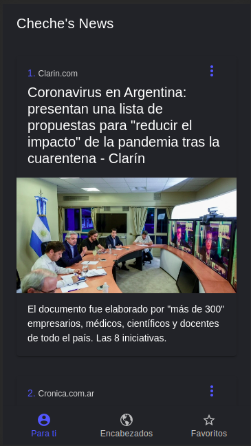
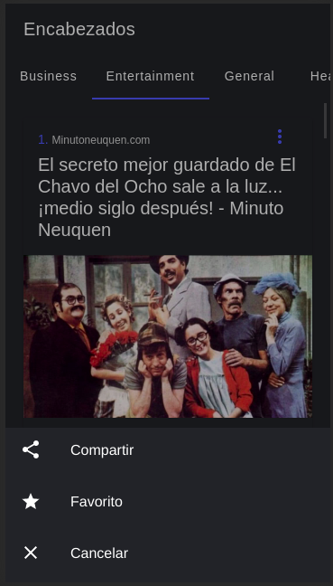

# News App

This app receives the news from an API and displays it for you.
You can open the news in your own native browser.
You can save or share the news.





This application has everything you need to convert this into PWA.


# Install

## Install the Ionic CLI

You need to have Ionic CLI in your system. You can see how to install it in **https://ionicframework.com/docs/intro/cli#install-the-ionic-cli**


## Install dependencies

You need to install all the dependencies on the project.

For install you need to run:

```
$ npm install
```


# Run the App

The majority of Ionic app development can be spent right in the browser using the ionic serve command:

```
$ ionic serve
```


# API

The News is getting from **https://newsapi.org/**


# Environments

All the environments vars are inside the folder */src/environments/*


# PWA

### Check these links: 

- [Deploying a Progressive Web App](https://ionicframework.com/docs/deployment/progressive-web-app)
- [Progressive Web Apps](https://web.dev/progressive-web-apps/)
- [Add a web app manifest](https://web.dev/add-manifest/)


### Create the PWA

The next command to create the folder *www* for the PWA. This folder you need load in your server.


```
$ ionic build --prod --service-worker
```

When you don't have an internet connection, the service worker loads the app from the *cache*.

**Warning** if you are using Cordova plugins, you need check the compatibility of the plugins.